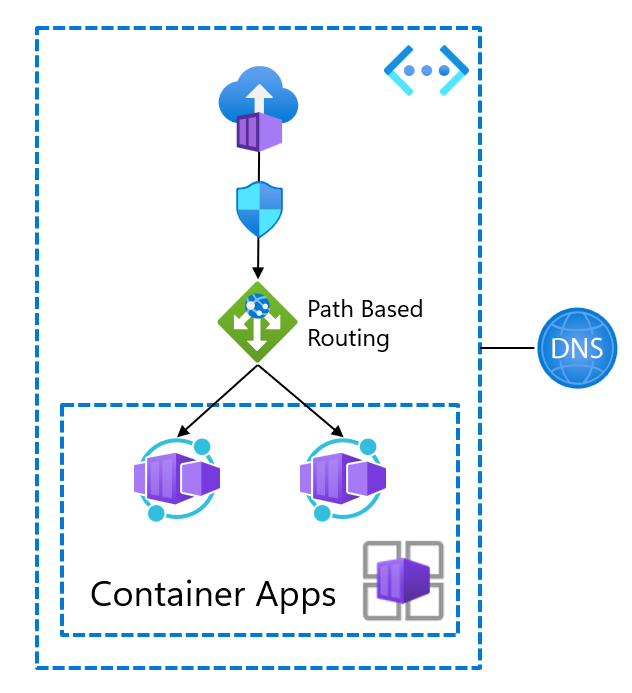

# APC Terraform meetup(8a1)向けサンプルコード

https://8a1-apc.connpass.com/event/306770/

## 概要

- TerraformのAzAPIプロバイダ、checkブロック、testコマンドのサンプルです
  - test、applyのたびにcheckブロックでe2eテスト結果を確認します
  - e2eテストはAzure Container Instanceがcurlで行います
- 頻繁に打つコマンドはMakefileに書いてあります
- 環境はDev Containerで作成できます
